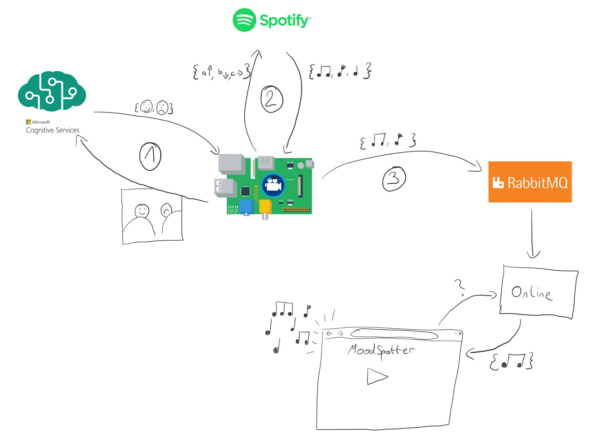
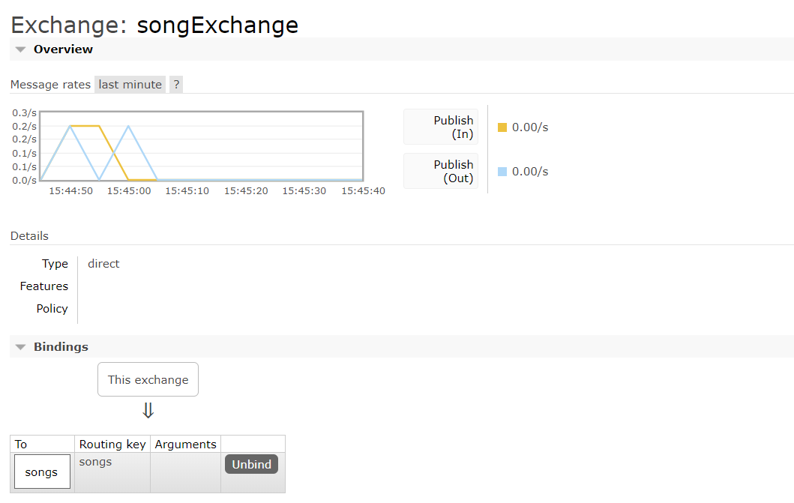
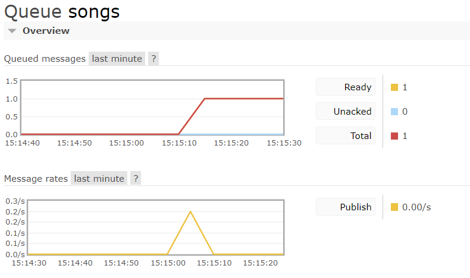
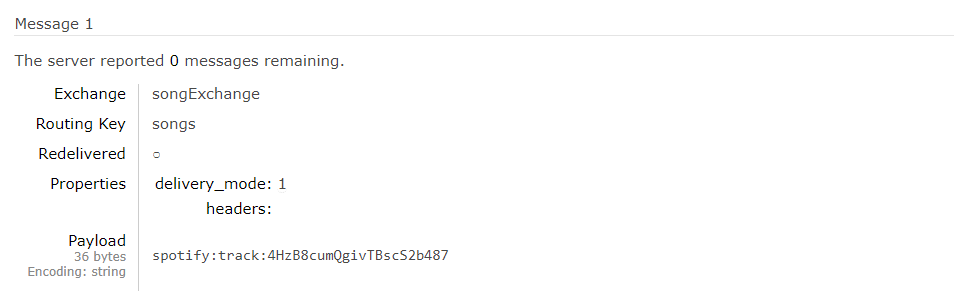
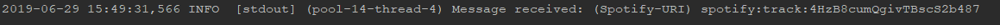
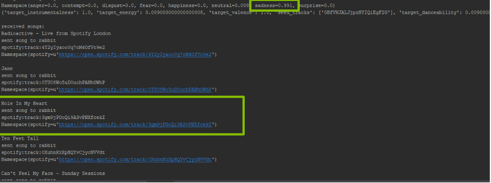
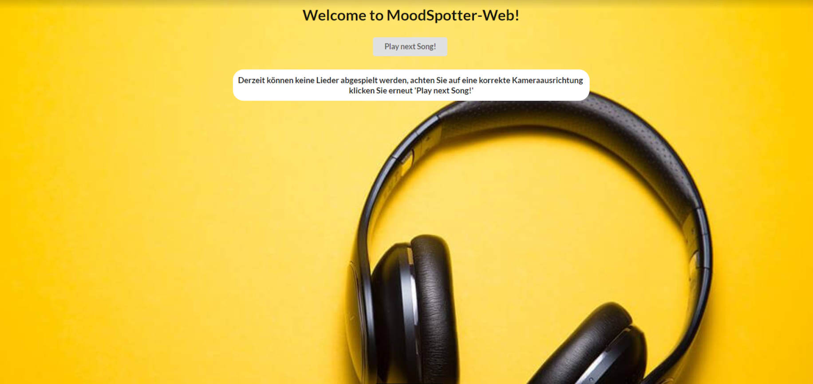
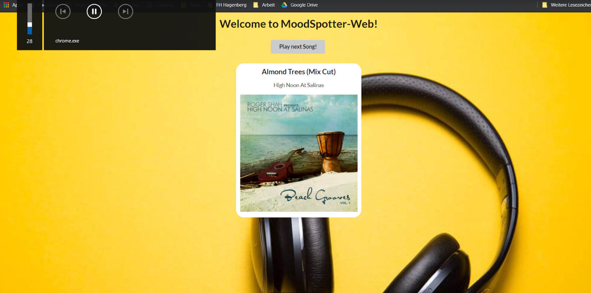
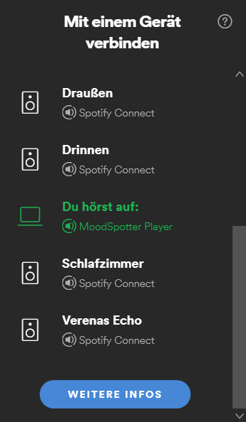

# MoodSpotter (music that fits how you feel)
Projektarbeit zu Mobile und ubiquitäre Systeme (MUS)

Projekt-Team: Tom Hacker und Verena Teufl

## Projektbeschreibung
### Problembeschreibung
Es ist allgemein bekannt, dass Musik einen starken Einfluss auf das emotionale Befinden von Personen hat. Jedoch ist das Finden von zur Stimmung passender Musik nicht immer so einfach sowie oftmals aufwendig oder nicht möglich. Häufig wird auch einfach nur darauf „vergessen“, wie sehr die Musik die Stimmung beeinflussen kann, und deshalb kommt keine zur Stimmung passende oder gar keine Musik zum Einsatz. Obwohl meist an denselben Plätzen Musik gehört wird (Auto, Wohnzimmer, Arbeitsplatz, Lokale, etc.), gibt es keinen Weg die Musik mit wenig Aufwand an die Stimmung anzupassen. Gerade beim Autofahren wäre eine vollautomatische Stimmungserkennung und daraufhin die Anpassung der Musik von Nutzen. So könnten brenzliche Situationen im Straßenverkehr schon im Vorhinein vermieden werden. Indem bei Aufregung beruhigende und bei Müdigkeit aufputschende Musik gespielt wird.

### Lösungsansatz
Zur Lösung des oben genannten Problems wird MoodSpotter entwickelt. Auf einem Raspberry Pi mit zusätzlichem Kamera-Modul werden in regelmäßigen Abständen Bilder aufgenommen. Mithilfe der Microsoft Cognitive Services werden die Emotionen der auf dem Bild befindlichen Personen ermittelt. Aufgrund der erhaltenen Informationen werden über die Spotify-API Lieder herausgesucht, die den gewünschten Effekt erzielen könnten. Die Spotify-API bietet Informationen zur Geschwindigkeit, Lebhaftigkeit und auch zur Stimmung eines Lieds. Mithilfe dieser Informationen, und den durch die Microsoft Cognitive Services API werden Lieder ermittelt, die zur aktuellen Stimmung der Person(en) vor der Kamera passen. Die ermittelten Lieder werden über Message-Oriented-Middleware (konkret RabbitMQ) und einem zusätzlichen Microservice einer Webanwendung übermittelt, wodurch eine Art Song-Queue simuliert wird. Die Webanwendung spielt daraufhin die Musik ab. Dem Benutzer werden Informationen zum gespielten Track angezeigt (z.B. Name, Artist und Album), und ihr/ihm ist es möglich - falls ihr/ihm das aktuelle nicht Lied gefällt - auf den nächsten umzuschalten. Reagiert die/der AnwenderIn auf das Lied biespielsweise "fröhlicher" als zuvor, werden ihr/ihm als übernächte Track entsprechend der Reaktion, welche wiederrum durch den Raspberry Pi ermittelt wurde, angepasste Songs vorgeschlagen.


## Architektur
<p align="center">
  
</p>

Der grundlegende Aufbau von MoodSpotter wird durch obiges Diagramm dargestellt.
Die Struktur lässt sich dabei am besten anhand der Benutzung von MoodSpotter erklären. Sie läuft wie folgt ab.

1. Die Kamera des Raspberry Pi nimmt ein Foto auf. Dieses Foto wird mittels REST an die *Microsoft Cloud API* geschickt und dort evaluiert. 

2. Aufgrund der Ergebnisse bestimmt der Raspberry Pi Zielmetriken für Lieder. Diese Metriken werden der Spotify API übergeben, welche zu diesen passende Lieder ermittelt.

3. Die URIs der erhaltenen Lieder werden an RabbitMQ geschickt. Der MoodSpotterOnline-Microservice bekommt diese von RabbitMQ übermittelt und speichert sie zwischen. Abschließend ruft der Web-Client das nächste zu spielende Lied vom Microservice ab, und spielt es im Browser.

## Technische Umsetzung

### Raspberry Pi
Das Kernstück von MoodSpotter ist der Raspberry Pi. Er nimmt die Bilder auf, spricht die APIs an und übernimmt das berechnen der Ziel-Liedmetriken.

#### Setup
Als Betriebssystem wird Raspian verwendet. Das Kameramodul wird am dafür vorgesehenen Anschluss installiert. Anschließend musste das Kamera-Modul in den Einstellungen noch aktiviert werden. Dies geschieht in der Raspberry Pi Config, erreichbar mit sudo raspi-config
Nachdem die Anwendung 'Moodspotter' beim Starten des Raspberry Pis sofort starten soll, wurde der Pfad zum Einstiegspunkt in der Datei */etc/rc.local* hinterlegt.
Dadurch wird das Programm im Boot-Prozess gestartet. 
Damit der Raspberry Pi mit den APIs und mit RabbitMQ kommunizieren kann, muss er außerdem in einem Netzwerk mit Internetzugriff sein. Um dies zu konfigurieren wurde er eingangs an einen Bildschirm, und an Tastatur und Maus angeschlossen.

#### Allgemein
Der Einstiegspunkt von MoodSpotter am Raspberry Pi befindet sich in der Datei *MoodSpotter.py*.
Hier werden zunächst die drei wichtigen Komponenten *MoodCamera*, *MoodDetector* und *SpotifyConnector* initialisiert.
Tritt beim Initialisieren der Kamera kein Fehler auf, so wird die *main_loop* gestartet, welche die Unterschiedlichen Komponenten steuert.

Mit jedem Durchlauf werden also das zuvor geschossene Bild geladen. Mit diesem Bild werden die MS Cognitive Services angesprochen.
Der boolean der Funktion *ms_get_image_data()* sagt dabei aus, ob das Bild Gesichter enthält. Trifft dies zu, so wird auf Spotify nach passenden Lieder gesucht und 30 Sekunden gewartet.
Wurde kein Gesicht gefunden, so wird lediglich 5 Sekunden gewartet und Spotify nicht nach Liedern durchsucht.
Zum Abschluss wird das nächste Foto geschossen, bevor die Schleife von vorne beginnt.
```python
def main_loop():
    while True:
        img_bytes = camera.get_image_bytes()
        if moodDetector.ms_get_image_data(img_bytes):
            spotifyConnector.browse_for_mood(moodDetector.currentMood)
            sleep(30)
        else:
            sleep(5)
        camera.take_photo()
```

Da für den Zugriff auf die externen APIs viele gleichbleibende Einstellungen vorzunehmen sind (beispielsweise URLs, Headers, usw.), wurden diese auf Konfigurationsdateien ausgelagert.
In der Datei Config.py befinden sich die allgemeinen Einstellungen. In der zusätzlichen Datei SecretConfig.py befinden sich die API-Passwörter. Diese Datei wird mittels .gitignore vom Upload auf Github ausgeschlossen.

#### Kameramodul
Als Bibliothek zum Ansprechen der Raspberry Pi Kamera wurde PiCamera verwendet (https://picamera.readthedocs.io/).
Die Methoden zum Aufnehmen und zum Laden der Fotos wurden in der Datei *MoodCamera.py* implementiert.
Das Aufnehmen von Fotos ist mit sehr wenigen Zeilen Code möglich. 
```python
def take_photo(self):
    if not os.path.exists(self.directory):
        os.makedirs(self.directory)
    try:
        self.camera.start_preview()
        sleep(5)
        self.camera.capture(self.directory + self.imgName)
        self.camera.stop_preview()
        return True
    except PiCameraError:
        print("There is no camera installed!")
        return False
```

Da das Bild im Dateisystem gespeichert wird, ist zusätzlich eine Methode zum Laden des Bildes nötig. Auch hierfür wird nicht viel Code benötigt.
```python
def get_image_bytes(self):
    if not os.path.exists(self.directory + self.imgName):
        return False
    img = open(self.directory + self.imgName, "rb")
    f = img.read()
    img.close()
    return f
```

Zum Start des Programms wird zunächst die Kamera in der Methode *init_camera()* initalisiert. Ist diese fertig initialisiert, wird außerdem sofort ein Foto aufgenommen, damit etwaige Probleme der Kamera sofort zu einem Fehlerfall führen.
 

#### Microsoft Cognitive Services
https://azure.microsoft.com/en-us/services/cognitive-services/face/

Die Face-API der Microsoft Cognitive Services dient zum Erkennen von Gesichtern in Bildern. Neben allgemeneinen Informationen zum Gesicht, beispielsweise den Abständen zu Gesichtsmerkmalen, können auch kompliziertere Informationen ermittelt werden. Möglich sind beispielsweise das Geschlecht, ungefähre Alter, getragene Accessoires, von der Person getragenes Make-Up, bis zur Stimmung der Person.

Für MoodSpotter relevant sind insbesonders die ermittelten Informationen zur Stimmung der Person. Jene wird in sieben wichtige Stimmungen eingeteilt, zurückgegeben werden Prozentewerte, die insgesamt die Stimmung beschreiben.

Folgende Werte werden dabei ermittelt:
* anger
* contempt
* disgust
* fear
* happiness
* neutral
* sadness


<p align="center">
  
</p>

Für dieses Beispielbild sieht man in der Response, dass die Stimmung der Person richtig auf *angry* eingeschätzt wird.

<pre>
 [
  {
    "faceId": "671edefc-7b1f-475d-b5a9-ace93925af57",
    "faceRectangle": {
      "top": 156,
      "left": 323,
      "width": 211,
      "height": 211
    },
    "faceAttributes": {
      "hair": {
        "bald": 0.03,
        "invisible": false,
        "hairColor": [
          {
            "color": "brown",
            "confidence": 0.99
          },
          {
            "color": "red",
            "confidence": 0.54
          },
          [...]
        ]
      },
      [...]
      "emotion": {
        <b>"anger": 1.0,</b>
        "contempt": 0.0,
        "disgust": 0.0,
        "fear": 0.0,
        "happiness": 0.0,
        "neutral": 0.0,
        "sadness": 0.0,
        "surprise": 0.0
      },
      [...]
    }
  }
]
</pre>


In MoodSpotter wird die API in der Klasse MoodDetector angesprochen. Der Zugriff geschieht über REST, dafür wird die *Requests*-Bibliothek verwendet. Die erhaltenen Daten werden daraufhin als Objekt zwischengespeichert.
```java
r = requests.post(ms_cognitive_url,
                  params=ms_cognitive_params,
                  headers=ms_cognitive_headers_byteimg,
                  data=byteImage)
faces = json.loads(r.text, object_hook=lambda d: Namespace(**d))

```


Daraufhin werden die von der API gelieferten Werte aller Gesichter zusammengefasst und intern gespeichert. Um Fehler durch einen momentan anderen Gesichtsausdruck zu vermeiden, bleiben die zuvor erhaltenen Werte erhalten, werden jedoch in ihrer Wichtigkeit um die Hälfte reduziert.
Hierfür ist die Klasse *FaceMood* zuständig.


#### Spotify-API
Die Spotify-API (https://developer.spotify.com/documentation/web-api/) bietet viele verschiedene Endpoints zur Nutzung der angebotenen Services, sowie zum Abfragen des von Spotify gebotenen Inhalts.
Möglich sind unter anderem Abfragen zu Liedern, Alben, Interpreten oder auch Nutzern. Auch das externe Steuern von mit Spotify verbundenen Geräten ist möglich. 
Die Authorisierung erfolgt mittels OAuth2. Jedoch können einige Endpoints auch ohne Login genutzt werden.

MoodSpotter nutzt den Browse/Recommendations-Endpoint der API. Dieser ermittelt anhand von Seed-Liedern dazu passende weitere Tracks. Zusätzlich können unterschiedliche Lied-Metriken angegeben werden, welche die erwarteten Ergebnisse in eine Richtung leiten oder einschränken sollen.
Weitere Dokumentation findet sich unter https://developer.spotify.com/documentation/web-api/reference/browse/get-recommendations/.

Die verwendeten Seeds, sowie die Ziel-Metriken werden von der Klasse FaceMood ermittelt.
So wird, falls eine Stimmung über 25% ist, für sie ein zufälliger passender Seed ausgewählt. Außerdem werden dann aufgrund des Prozentsatzes die Lied-Metriken errechnet, als Beispiel die Logik für die Stimmung *Happiness*.
Initial sind alle Werte auf 100% gesetzt. Passende Lied-Metriken werden mit der Stimmung multipliziert, unpassende mit dem invertierten Wert der Stimmung multipliziert (werden also verringert).

```python
if self.happiness > .25:        #play positive, happy songs
    seed = random.choice(spotify_happy_seeds)
    target_values['seed_tracks'].append(seed)
    target_values['target_energy'] *= max(self.happiness, self.anger)
    target_values['target_danceability'] *= self.happiness
    target_values['target_liveness'] *= self.happiness
    target_values['target_valence'] *= self.happiness
    target_values['target_instrumentalness'] *= 1 - self.happiness
```

Als Antwort liefert Spotify eine durch einen Parameter festgelegte Menge an Liedern (oder weniger, bei restriktiven Abfragen).
Die Informationen zu den Liedern enthalten unter anderem den Name des Liedes, Name des Albums, Interpreten und einen Link zum Starten des Liedes in der eigenen Spotify-Weboberfläche (https://open.spotify.com). Für MoodSpotter ist besonders die übermittelte eindeutige URI wichtig, anhand ihrer kann jede andere Anwendung dieses Lied abfragen und daraufhin abspielen.
Hier ein Teil der Response, jedoch ohne die sehr ausführlichen Informationen zu Album und Interpreten.

```json
{
  "disc_number" : 1,
  "duration_ms" : 199133,
  "explicit" : false,
  "external_urls" : {
    "spotify" : "https://open.spotify.com/track/1TKYPzH66GwsqyJFKFkBHQ"
  },
  "href" : "https://api.spotify.com/v1/tracks/1TKYPzH66GwsqyJFKFkBHQ",
  "id" : "1TKYPzH66GwsqyJFKFkBHQ",
  "is_playable" : true,
  "name" : "Music Is Life",
  "preview_url" : "https://p.scdn.co/mp3-preview/546099103387186dfe16743a33edd77e52cec738",
  "track_number" : 1,
  "type" : "track",
  "uri" : "spotify:track:1TKYPzH66GwsqyJFKFkBHQ"
}
```


#### RabbitMQ
Die URIs der gewählten Lieder werden an RabbitMQ geschickt. Mehr Informationen finden sich im nächsten Abschnitt, hier geht es lediglich um die Anbindung am Raspberry Pi.
Der Zugriff am Raspberry Pi, wiederum in der Klasse SpotifyConnector, genutzt wird dazu die Bibliothek Pika (https://pika.readthedocs.io/en/stable/).
Zunächst werden Exchange (*songExchange*) und Queue (*songs*) definiert. Über ein Binding an die Exchange vom Typ DIRECT werden alle Nachrichten mit dem passenden Routing-Key an die Queue *songs* weiterleitet.

```python
def send_to_rabbit(self, uri):
    try:
        connection = pika.BlockingConnection(pika.URLParameters(rabbitMq_url))
        channel = connection.channel()
        channel.exchange_declare(exchange='songExchange', exchange_type='direct')
        channel.queue_declare(queue='songs')
        channel.queue_bind(exchange='songExchange', queue='songs')
        channel.basic_publish(exchange='songExchange', routing_key='songs', body=uri)
        connection.close()
        print("sent song to rabbit")
    except ConnectionError:
        print("error connecting to rabbitMQ")
```


### RabbitMQ Message-Broker
#### Allgemein
Damit das Raspberry Pi Modul und die MoodSpotter-Webanwendung miteinander kommunizieren können, tauschen sich diese über Message-Oriented-Middleware, konkret RabbitMQ aus. Beziehungweise die Webanwendung indirekt, da eigentlich ein zusätzlicher Microservice 'MoodSpotterOnline' Subscriber ist und die erhaltenen Lieder daraufhin der Webanwendung anbietet.

Da sich der Raspberry Pi und der Microservice unter realen Bedingungen in unterschiedlichen Netzwerken befinden, musste, um auf beiden Seiten eine simple Anbindung an den RabbitMQ-Broker zu ermöglich, eine entsprechende Lösung evaluiert werden. Es wurde auf einen Anbieter gesetzt, welcher RabbitMQ-Insatzen (unteranderem gratis) online hostet (https://www.cloudamqp.com/). Dadurch wird der RabbitMQ Message-Broker über eine fixe Web-URL zugänglich, auf welche sich der RaspberryPi und der Microservice (solange diese Internetzugriff haben) verbinden können.

#### Aufbau
Wie schon im Abschnitt zu *Raspberry Pi und RabbitMQ* hervorgeht, gibt es am RabbitMQ-Broker eine vordefinierte Exchange. Jene hat den Namen *songExchange* und ist vom Typ *DIRECT*. 

<p align="center">
  
</p>

Die zu spielendenden Lieder werden an die Queue *songs* geroutet, welche mit dem Routing-Key *songs* an obige Exchange gebunden ist.

<p align="center">
  
</p>

<p align="center">
  
</p>


### Microservice 'MoodSpotterOnline'
#### Allgemein
Der Microservice wurde mittels Java EE und dem Microserivce-Framework 'Thorntail' (https://thorntail.io/) umgesetzt. Dadurch kann dieser Service später überall leichtgewichtigt deployt werden und ist von keinem umgebenden Application-Server abhängig.

#### RabbitMQ und Song-Queue
Der Microservice ist Subscriber der Queue *songs*. Die Logik zum Holen der Songs befindet sich in der Klasse *RabbitMQClient*. 

```java
Connection connection = factory.newConnection();
            Channel channel = connection.createChannel();
            
channel.basicConsume(QUEUE_NAME, true,
        new DefaultConsumer(channel) {
            @Override
            public void handleDelivery(String consumerTag,
                                       Envelope envelope,
                                       AMQP.BasicProperties properties,
                                       byte[] body)
                    throws IOException {
                System.out.print("Message received: ");
                message = new String(body);
                System.out.println("(Spotify-URI) " + message);
                uriQueue.add(message);
            }
        });
```

Logging beim Empfangen einer Nachricht:
<p align="center">
  
</p>

Jede empfangene Nachricht wird intern in eine eigene Queue-Datenstruktur (*SizedQueue*) gelegt, welche maximal 6 Lieder zwischenpuffert. 

```java
private Queue<String> uriQueue = new SizedQueue<>(6);
  
// ...
  
public String getSong() {
      try {
          return uriQueue.poll();
      }
  }
```
Beim Aufruf der Methode *getSong* wird das nächste Lieder von der Queue geholt und kann so weiterverarbeit werden.

#### REST-Schnittstelle
Über den REST-Endpoint *localhost:8082/api/song* hat de Webanwendung sodann Zugriff auf das nächste zu spielende Lied:

```java
@Path("/song")
public class SongResource {

    @Inject
    RabbitMQClientInterface rabbitMQClient;

    @GET
    @Produces(MediaType.APPLICATION_JSON)
    public Response getNextSongURI() {
        SongDTO song = new SongDTO(rabbitMQClient.getSong());
        return Response.ok(song).build();
    }
}
```

#### Docker-Deployment
Durch den Einsatz des Microserivce-Framework ist es möglich, den Service in einem Docker-Container laufen zu lassen. Die einzelnen Script befinden sich im Ordner 'Doker' (im Root-Verzeichnis dieses Repositories).  Das Script *build.ps1* kopiert zunächst die generierten *uberjars* des Microserivce-Frameworks 'Thorntail' in den zugehörigen Ordner, und führt daraufhin *docker-compose* aus. Der Doker-Container zu MoodSpotter wird über das File *docker-compose.yml* konfiguriert und lässt sich anschließend mit *docker-compose up* hochfahren:

```yml
version: "3"
services:
    container_name: MoodSpotterOnline
    build: .
    ports:
        - "8082:8082"
```


### Web-Anwendung 'MoodSpotterWeb'
#### Allgemein
Wie bereits erwähnt, können die zur Stimmung ermittelten Lieder über einen eigen mit Spotify-Integration entwickelten Web-Player abgespielt werden. Die Webapplikation wurde mit Angular 8 (Typescript) und JavaScript umgestzt. Jene läuft auf *\<host\>:4200*. 

#### Spotify Playback SDK
Um die Spotify-Integration zu ermöglichen, wurde das von Spotify entwickelte 'Web Playback SDK' (https://developer.spotify.com/documentation/web-playback-sdk/reference/) eingesetzt. 

Die Library für das 'Web Playback SDK' kann folgendermaßen eingebunden werden:
```javascript
<script src="https://sdk.scdn.co/spotify-player.js"></script>
```
Da es sich dabei um eine JavaScript-Library handelt, wurde die gesamte Funktionalität zum Integrieren des eigenen Webplayer in ein eigenes Script ausgelagtert. Das Script befindet sich unter *assets/player.js* und wird später in den HTLM-Templates von Angular eingebunden.

Im Script wird die Funktion *initPlayer* definiert, welche später von Angular aus aufgerufen werden kann. In dieser wird die Initalisierung des Spotify-WebPlayback durchgeführt (*onSpotifyWebPlaybackSDKReady*). Zunächst wird ein neuer Player definiert. Es können dabei der Name (hier: MoodSpotter Player -> unter diesen Namen wird jener später u.a. bei den Spotify-Connect Geräten aufgelistet) als auch ein Access-Token (welches die zugehörigen Benutzerinformationen enthält), um den Player einem Spotify-Konto zuordnen zu können, angegeben werden.

```javascript
function initPlayer() {
  window.onSpotifyWebPlaybackSDKReady = () => {
    const player = new Spotify.Player({
      name: 'MoodSpotter Player',
      getOAuthToken: cb => { cb(token); }
    });
    
    //player connected
    player.connect();
    
     //player ready
    player.addListener('ready', ({ device_id }) => {
      console.log('Ready with Device ID', device_id);
      moodSpotterDevicdId = device_id;
    });
   }
}
```
Über den Aufruf von *player.connect()* wird der definierte Player 'erstellt' und dem angegebenen Spotify-Konto zugewiesen. Über mehrere Callback-Methoden können auf dem Player-Objekt bestimmte (Status)Informationen abgefragt werden. Beispielsweise kann über das Callback *ready* die Device-ID des Players ermittelt werden. Diese stellt eine wichtige Information dar, denn anhand dieser ID kann später über einen REST-Call an die Spotify-API mitgeteilt werden, auf welchem Gerät, welches Lied gespielt werden soll.


#### Abspielen des Songs (Informationen zum Song)
Das Abspielen eines bestimmten Songs wird ebenfalls in eine eigene JavaScript-Funktion ausgelagert (*playSongInternal*). Der Funktion wird die vorher ausgelesene Device-ID, ein Access-Token zur Authentifizierung und die Spotify-URI des zu spielenden Lieds mitgegeben. Die übergebenen Parameter werden in folgenden REST-Call verpackt:

```javascript
function playSongInternal(device_id, _token, trackUri) {
  $.ajax({
    url: "https://api.spotify.com/v1/me/player/play?device_id=" + device_id,
    type: "PUT",
    data: '{"uris": ["' + trackUri + '"]}',
    beforeSend: function (xhr) { xhr.setRequestHeader('Authorization', 'Bearer ' + _token); },
    success: function (data) {
    }
  });
  
//for external call
function playSong(uri) {
  playSongInternal(moodSpotterDevicdId, token, uri);
}
```
Zur einfacheren Verwendung von Angular aus wird zusätzlich die Funktion *playSong* definiert, welcher nur der nächste zu spielende Track übergeben wird.

Um nun zusätzliche Informationen zum aktuell gespielten Lied zu bekommen, kann das über den Player-Callback *player_state_changed* erhaltene Objekt geparst und auf folgende Komponenten abgefragt werden:

```javascript
function parseTrack(uri) {
  if (uri != null) {
    this.currTrack = uri.track_window.current_track.name;
    this.currArtist = uri.track_window.current_track.artists[0].name;
    this.currAlbumImg = uri.track_window.current_track.album.images[0].url;
  }
}
```
Die einzelnen Eigenschaften (Name, Artist und Album-Bild) werden zwischengespeichert, woraufhin die Angular-App diese über Funktionen wie *getTrackName* oder *getArtist* abfragen kann.

#### Player-Component (Java-Script Calls und REST-Kommunikation)
Um die im Script definierten Funktionen in Angular verwenden zu können, müssen diese folgendermaßen deklariert werden:
```typescript
//declare functions from javaScript "player.js"
declare function initPlayer()
declare function playSong(uri);
```

Die Hauptfunktionalität der Player-Component besteht darin, das nächste zu spielende Lied vom Microservice 'MoodSpotterOnline' zu holen. Dazu wird das HTTPClient-Modul verwedet, um einen REST-Call an den Service zu senden. Die erhaltene Response wird in der  Datenkomponente *currSong* gespeichert. Anschließend wir die darin enthaltene Spotify-URI an die vorher definierte JavaScript-Funktion *playSong* übergeben. Daraufhin wird das Lied abgespielt. Ebenso werden die ensprechenden Informationen zu diesen Lied geholt und zwischengespeichert, um diese im Frontend anzeigen zu können.

```typescript
apiEndpoint = "http://localhost:8082/api/song"

getSong() {
    this.http.get(this.apiEndpoint)
      .subscribe(response => {
        //get song
        this.currSong = response.song;

        //play song
        if (this.currSong != null)
          playSong(this.currSong);

        //get infos
        (async () => {
          await this.delay(400);
          this.currSongName = getTrackName();
          this.currArtist = getArtist();
          this.currAlbumImg = getAlbumImg();
        })();
      }
      );
  }
```

#### User-Interface
Die/der BenutzerIn hat die Möglichkeit über die Weboberfläche mit dem Player zu interagieren. Falls ihr/ihm das aktuelle Lied nicht gefallen sollte, kann über Klick auf den Button *Play next Song!* auf den nächsten Track weitergeschalten werden. Daraufhin wird die in der Player-Component definierte Funktion *getSong()* aufgerufen und daraufhin das nächste Lied gefetcht.

```html
<button class="ui button" value="Play next Song" (click)="getSong()">Play next Song!</button>
```
Wie die UI für den Benutzer aussieht, wird im nächsten Abschnitt *Ergebnisse* aufgezeigt.


## Ergebnisse
In diesem Abschnitt wird näher auf die erhalten Ergebnisse der einzelnen Komponenten (Raspberry Pi und den Web-Player) eingegangen um das korrekte Verhalten darzustellen.

#### Raspberry Pi
Sobald der Raspberry Pi angesteckt wird, startet MoodSpotter. Er nimmt erfolgreich Fotos auf, diese werden von den Microsoft Cognitive Services ausgewertet.
Diese Werte werden in Lied-Metriken umgerechnet, welche die Spotify API zum wählen passender Lieder nutzt. Die gefundenen Lieder werden daraufhin an RabbitMQ weitergegeben.
Anhand der Debugging Ausgabe lässt sich nachvollziehen, wie das ermitteln der Lieder abläuft.

<p align="center">
  
</p>

Aufgrund des hohen *Sadness* Wertes werden Lieder mit hoher Instrumentalness, und niedrigem Energiewert gesucht. Zusätzlich wird auch die Tanzbarkeit des Liedes niedrig angesetzt.
Das Seed-Lied hatte in diesem Fall die ID *0BfVKJALJjpzNYIQiEgF2G*, dabei handelt es sich um das Lied Waves von Dean Lewis.
Die dafür gefundenen Lieder wirken alle etwas traurig, was genau das von uns gewünschte Ergebnis war, hier zwei Beispiele:

Radioactive
https://open.spotify.com/track/4Y2yIyaoo0q7cM4OfVc9e2?si=2TVeNAGCRDWiTgPK4m3Gpw

Can't feel my face
https://open.spotify.com/track/5zwNJ8meHAvLwHsQ1QCrZD?si=Xle2wrCfQlORd9UxPEB4YQ


#### Web-Player
Das Ergebnis des 'MoodSpotter-Player' kann durch eine funktionierende Web-Oberfläche mit Spotify-Integration dargestellt werden. Wird der Player gestartet oder es können keine weiteren Lieder mehr abgespielt werden, da eventuell das Kameramodul nicht richtig ausgerichtet ist, und somit der Raspberry Pi keine Gesichter erkennen kann, ist für die/den BenutzerIn folgende Web-Oberfälche zu sehen:

<p align="center">
  
</p>

Klickt die/der BenutzerIn nun auf den Button *Play next Song!* wird daraufhin das nächste Lied abgespielt und dementsprechend die Infos zu dem Track angezeigt. Über die eingebaute Webbrowser-Funktionalität kann der aktuell gespielte Song pausiert oder weitergespielt werden.

<p align="center">
  
</p>

Wie bereits erwähnt, ist dieser Player einem konkreten Spotify-Nutzer zugeordnet und erscheint nun unter den auswählbaren Spotify-Connect Geräten. Sprich dieser Web-Player kann somit auch unabhängig von der MoodSpotter-Funktionalität verwendet und so beispielsweise über die Spotify Mobile-App gesteuert werden.

<p align="center">
  
</p>


#### Zusammenfassung und Ausblick
Zusammengefasst ist ein der Projektanforderungen genügendes Produkt entstanden, dass nun an verschiedenen Orten installiert werden könnte um die Musikfindung für spezifische Situationen zu erleichtern.

Das entstandene Produkt 'MoodSpotter' hat durchaus Potential zur Weiterentwicklung. Als Beispiel können die algoritmische Berechnung zur Ermittlung der Lieder oder eine umfangreichere Web-UI genannt werden. Im Hinblick darauf müssten aber auch noch die APIs von MS Cognitive Services und Spotify mit mehr Funktionalität ausgebaut werden. 
